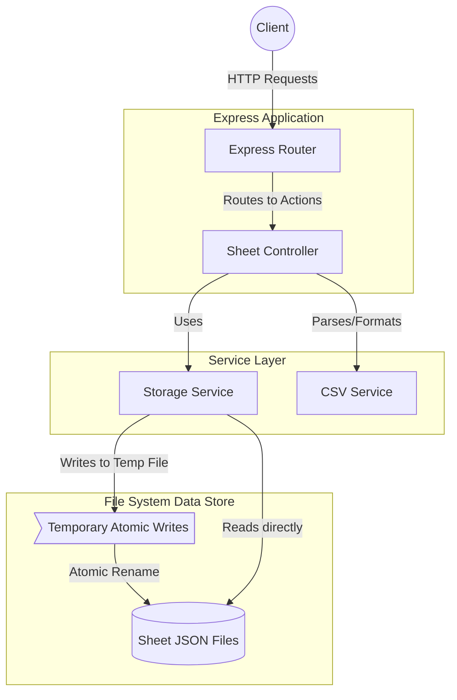

# Persistent Spreadsheet Application

An interview-ready Node.js backend application offering a persistence layer for a conceptual spreadsheet program, including atomic JSON file storage and CSV Import/Export endpoints with basic formula evaluation.

## Architecture Overview

The system architecture features a layered design, effectively decoupled for integration testing.



### Key Technical Approaches

1. **Testability / Decoupling**: The application Express instance (`src/app.js`) is decoupled from the HTTP server instantiation (`src/server.js`), allowing native integration testing using Jest without port-binding conflicts.
2. **Data Integrity & Atomic Writes**: The `StorageService` leverages standard filesystem operations to create a reliable pseudo-database. When saving a sheet state, the application writes to a unique temporary file (`Crypto.randomBytes`) and then executes an atomic filesystem `rename`. This guarantees that if the server crashes mid-write, the original JSON file is never left in a corrupted state.
3. **CSV Parsing**: The `csvService` supports spreadsheet import and export bridging the Gap between standard CSVs and standard State representation. Formulas (denoted with a leading `=`) are mathematically evaluated before being populated in an outgoing export.
4. **Containerization**: Application runs within Docker with mounted volumes (`./app_data`) persisting files from the container down to the host machine.


## Setup Instructions

### Local Development

1. Install dependencies:
   ```bash
   npm install
   ```

2. Run the server (default port 3000):
   ```bash
   npm run dev
   ```

3. Run Tests:
   ```bash
   npm run test
   ```
 *(Note: add the scripts `"test": "jest app.test.js"` in `package.json` to map tests)*

### Docker Deployment

1. **Build and Start Container**
   ```bash
   docker-compose up -d --build
   ```
2. **Ping Healthcheck**
   ```bash
   curl http://localhost:3000/health
   ```
3. **Stop Container**
   ```bash
   docker-compose down
   ```

## API Endpoints

| Endpoint | Method | Description |
| :--- | :--- | :--- |
| `/health` | GET | Healthcheck returning `{ status: "ok" }`. |
| `/api/sheets/:sheetId/state` | GET | Retrieve the serialized JSON map of the requested sheet. |
| `/api/sheets/:sheetId/state` | PUT | Save a sheet JSON map. Requires a `{ "cells": { ... } }` payload. |
| `/api/sheets/:sheetId/import` | POST | Upload a multipart form `file` containing a target CSV, overwriting state. |
| `/api/sheets/:sheetId/export` | GET | Download a rendered representation of the state computing evaluated equations. |

### API Test Cases & Examples

#### 1. Healthcheck (`GET /health`)
- **Success (200 OK)**
  ```bash
  curl http://localhost:3000/health
  # Response: { "status": "ok" }
  ```

#### 2. Save Sheet State (`PUT /api/sheets/:sheetId/state`)
- **Success (204 No Content)**
  ```bash
  curl -X PUT http://localhost:3000/api/sheets/sheet1/state \
       -H "Content-Type: application/json" \
       -d '{"cells": {"A1": {"value": "Hello"}, "A2": {"value": "World"}}}'
  # Response: (Empty body, 204 status)
  ```
- **Failure - Invalid Body (400 Bad Request)**
  ```bash
  curl -X PUT http://localhost:3000/api/sheets/sheet1/state \
       -H "Content-Type: application/json" \
       -d '{}'
  # Response: { "error": "Invalid JSON body" }
  ```
- **Failure - Malformed JSON (400 Bad Request)**
  ```bash
  curl -X PUT http://localhost:3000/api/sheets/sheet1/state \
       -H "Content-Type: application/json" \
       -d '{"cells":'
  # Response: { "error": "Malformed JSON" }
  ```

#### 3. Load Sheet State (`GET /api/sheets/:sheetId/state`)
- **Success (200 OK)**
  ```bash
  curl http://localhost:3000/api/sheets/sheet1/state
  # Response: { "cells": { "A1": { "value": "Hello" }, "A2": { "value": "World" } } }
  ```
- **Failure - Not Found (404 Not Found)**
  ```bash
  curl http://localhost:3000/api/sheets/missing_sheet/state
  # Response: { "error": "Sheet not found" }
  ```

#### 4. Import CSV (`POST /api/sheets/:sheetId/import`)
- **Success (204 No Content)**
  ```bash
  # Assuming you have a file named data.csv
  curl -X POST http://localhost:3000/api/sheets/sheet1/import \
       -F "file=@data.csv"
  # Response: (Empty body, 204 status)
  ```
- **Failure - No File Provided (400 Bad Request)**
  ```bash
  curl -X POST http://localhost:3000/api/sheets/sheet1/import
  # Response: { "error": "No CSV file provided" }
  ```

#### 5. Export CSV (`GET /api/sheets/:sheetId/export`)
- **Success (200 OK)**
  ```bash
  curl http://localhost:3000/api/sheets/sheet1/export
  # Response: CSV file content
  ```
- **Failure - Not Found (404 Not Found)**
  ```bash
  curl http://localhost:3000/api/sheets/missing_sheet/export
  # Response: { "error": "Sheet not found" }
  ```

